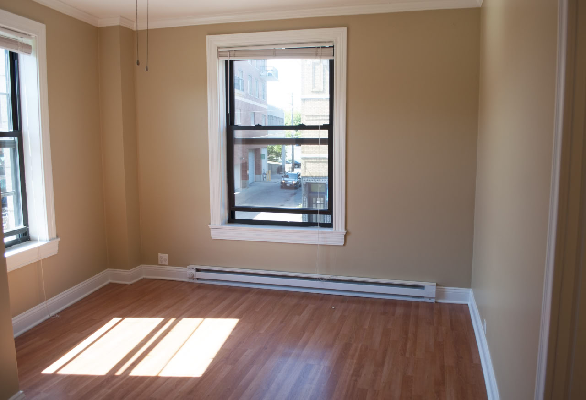
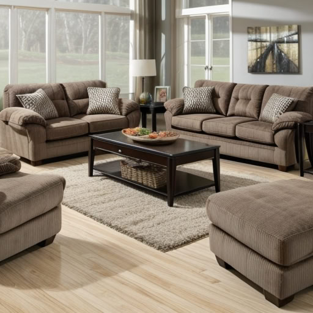

# Interior Desings (Realistic Vision)

Este proyecto proporciona una interfaz sencilla para entrenar y utilizar modelos de diseño de interiores

    
    

Input: Add a sofa and furnish with furniture

## Descripción General

El proyecto consta de dos funciones principales:

1.  `TrainModel`: Esta función se utiliza para entrenar o cargar un modelo de difusión pre-entrenado y guardarlo en un directorio específico.
2.  `MainModel`: Esta función carga un modelo guardado previamente y lo utiliza para generar una imagen basada en un texto descriptivo (prompt), una imagen inicial, y configuraciones personalizadas.

## Primeros Pasos

### Prerrequisitos

Antes de empezar, necesitarás tener instalado lo siguiente:

*   **Python 3.7+**
*   **Bibliotecas requeridas**:
    * `PyTorch`: Ejecute este comando `pip install torch torchvision torchaudio --index-url https://download.pytorch.org/whl/cu118`

Puedes instalar todas las dependencias necesarias ejecuta: `pip install -r requirements.txt`

### Configuración

*   **`dir_path`**: El directorio que contiene el archivo del modelo guardado (`model.pkl`).
*   **`prompt`**: La descripción textual para la imagen que deseas generar.
*   **`image_path`**: La ruta del archivo de una imagen inicial utilizada para guiar la generación de la imagen.
*   **`output_path`**: La ruta del archivo donde se guardará la imagen generada.
*   **`settings`**: Un diccionario con configuraciones para la generación de imágenes.
    *   **`negative_prompt`**: La descripción textual negativa para especificar lo que no deseas en la imagen generada.
    *   **`num_inference_steps`**: El número de pasos en el proceso de difusión para generar la imagen.
    *   **`guidance_scale`**: La escala de guía para controlar el nivel de apego al texto descriptivo.
    *   **`prompt_strength`**: La fuerza de la imagen inicial de entrada, si se proporciona.
    *   **`seed`**: Una semilla aleatoria para la reproducibilidad.
*   *   **`additional_quality_suffix`**: una cadena que añade detalles al texto descriptivo para aumentar la calidad de la imagen.

*   **Funcionalidad:**
    *   Carga el modelo guardado del directorio especificado.
    *   Comprueba si el texto descriptivo menciona un tipo de habitación como dormitorio o cuarto de niños, si es así, añade información adicional para mejorar la imagen generada.
    *   Construye el texto descriptivo final combinando la entrada del usuario con detalles adicionales para mejorar la calidad.
    *   Genera la imagen utilizando el modelo cargado, la configuración y el texto descriptivo.
    *   Guarda la imagen generada en la ruta de salida especificada.

## Notas

*   El código incluye manejo de errores para situaciones en las que el archivo del modelo no existe.
*   Asegúrate de tener una buena conexión a Internet al cargar modelos desde Hugging Face la primera vez.
*   Si no hay errores, ambas funciones imprimirán en la consola el resultado de sus ejecuciones.